# Azure Networking, Identity, and Storage Lab

## Overview

This project demonstrates the deployment of a small Azure cloud environment including networking, compute resources, identity management, and storage services.

The lab simulates real cloud engineering tasks such as deploying virtual machines, configuring network segmentation, implementing security controls, managing user access through Role-Based Access Control (RBAC), and managing cloud storage.

---

## Architecture

The environment includes:

- Resource Group: RG-CloudLab
- Azure Virtual Network
- Subnet (Subnet-Servers)
- Two Windows Server Virtual Machines
- Network Security Group (NSG)
- Azure AD Users (Microsoft Entra ID)
- RBAC Role Assignments
- Azure Storage Account
- Blob Storage Container

---

## Technologies Used

- Microsoft Azure
- Azure Virtual Machines
- Azure Virtual Network
- Network Security Groups
- Microsoft Entra ID (Azure AD)
- Role-Based Access Control
- Azure Blob Storage
- Windows Server
- Remote Desktop Protocol (RDP)

---

## Deployment Steps

### 1. Resource Group Creation

A resource group named **RG-CloudLab** was created to organize all Azure resources deployed in this environment.

---

### 2. Virtual Network Deployment

A Virtual Network was deployed with the following configuration:

Address Space

```
10.0.0.0/16
```

Subnet Configuration

```
Subnet-Servers
10.0.1.0/24
```

This subnet hosts both virtual machines used in the lab.

---

### 3. Virtual Machine Deployment

Two Windows Server virtual machines were deployed.

VM1

```
Name: VM-CloudLab-01
Private IP: 10.0.1.4
```

VM2

```
Name: VM-CloudLab-02
Private IP: 10.0.1.5
```

Both VMs were configured with **Remote Desktop Protocol (RDP)** access.

---

### 4. Network Security Configuration

A Network Security Group was configured to control inbound traffic.

NSG Name

```
VM-CloudLab-01-nsg
```

Inbound Rule

```
Allow RDP
Port: 3389
Protocol: TCP
Source: Any
```

This rule enables administrative access to the virtual machines.

---

### 5. Connectivity Testing

Connectivity between both virtual machines was validated using **ping**.

From VM1:

```
ping 10.0.1.5
```

Results confirmed successful communication with **0% packet loss**, verifying proper virtual network and subnet configuration.

---

### 6. Identity Management

Multiple Azure Active Directory users were created to simulate identity management.

Example users created:

- Bob Jones
- Greg Johnson
- John Smith
- Labuser1

---

### 7. RBAC Configuration

Role-Based Access Control permissions were assigned to control resource access.

Example role assignments:

```
Owner: Brandon Kante
Contributor: Greg Johnson
Reader: Labuser1
```

This demonstrates how RBAC controls different permission levels within Azure.

---

### 8. Storage Configuration

An Azure Storage Account was created.

Storage Account

```
cloudlabstoragebk1
```

Blob Container

```
labfiles
```

A test file was uploaded to validate storage functionality.

Uploaded file

```
Mohamed_Kante_CR.pdf
```

## Screenshots

### Resource Group
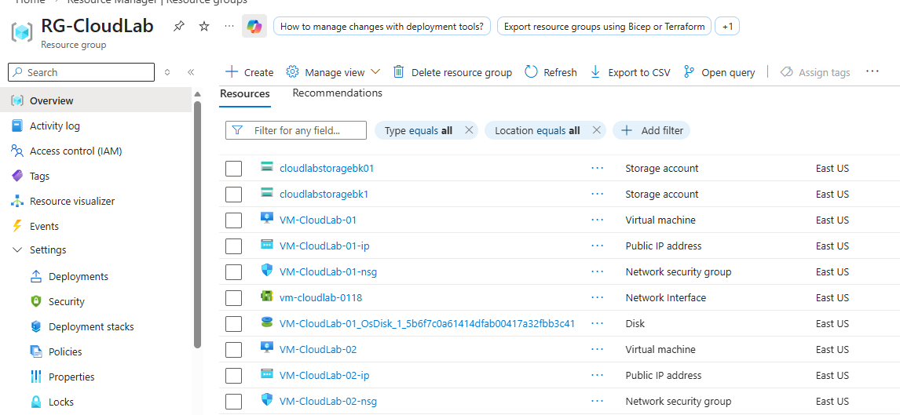

### Virtual Network
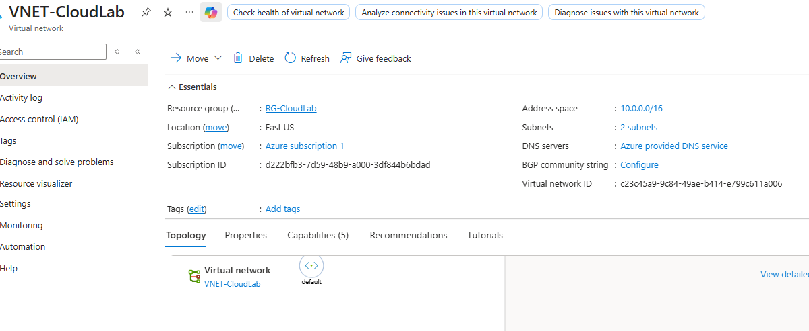

### Subnets
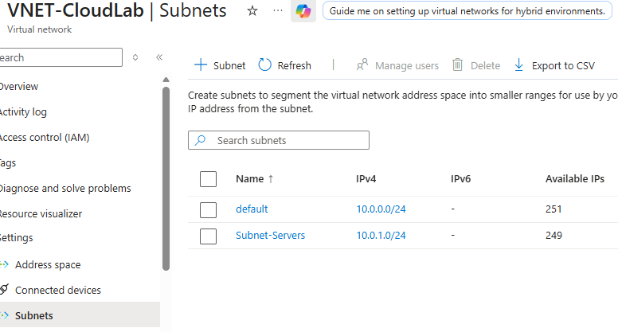

### VM1 Overview
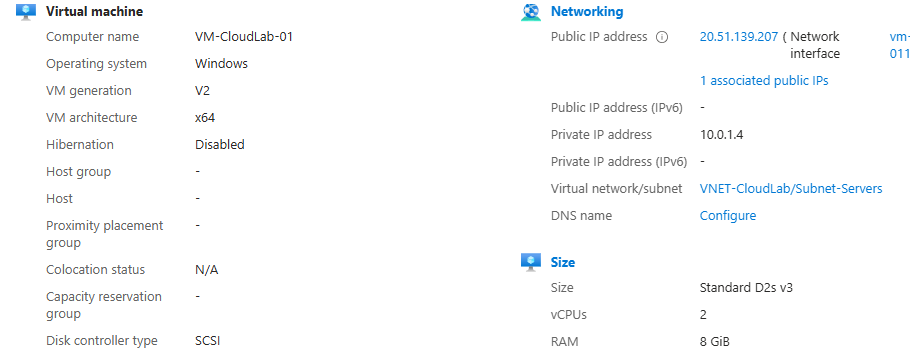

### VM1 Networking


### VM2 Overview
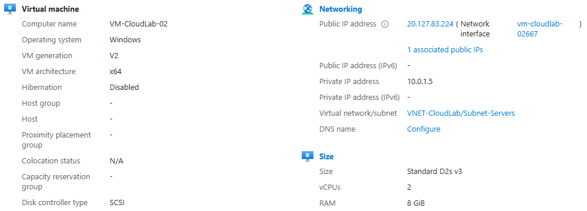

### VM2 Networking
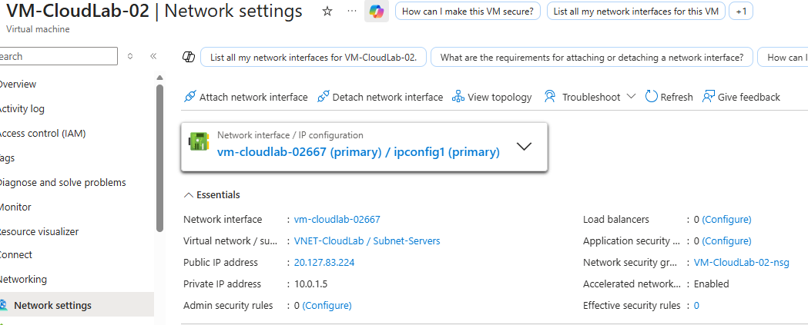

### Network Security Group Rules


### Connectivity Test
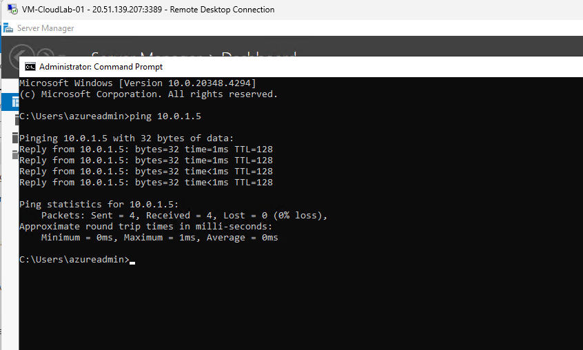

### Azure AD Users
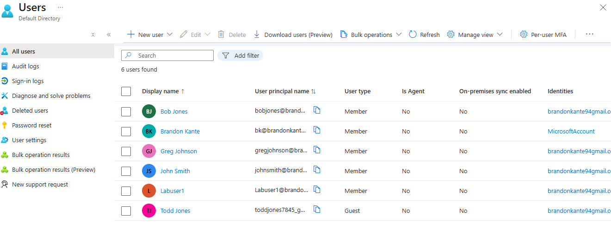

### RBAC Role Assignment


### Storage Account
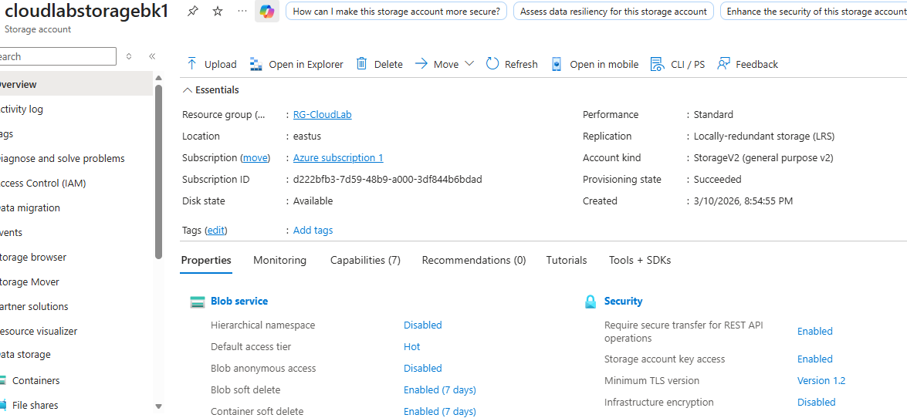

### Blob Container
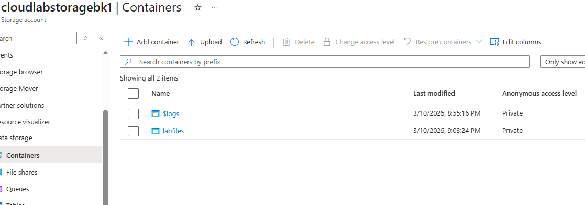

### Blob Upload
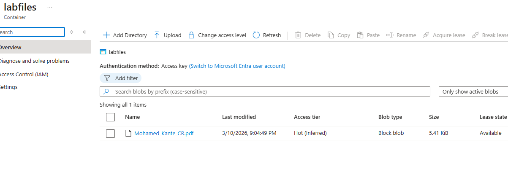

---

## Skills Demonstrated

- Azure Infrastructure Deployment
- Virtual Network and Subnet Configuration
- VM Deployment and Administration
- Network Security Group Configuration
- Identity and Access Management (Azure AD)
- Role-Based Access Control (RBAC)
- Azure Blob Storage Configuration
- Cloud Infrastructure Documentation

---

## Lessons Learned

This lab reinforced key Azure administration concepts including network segmentation, identity management, role-based access control, and cloud storage management.

It also demonstrated the importance of documenting infrastructure deployments using GitHub to create a professional cloud engineering portfolio.
